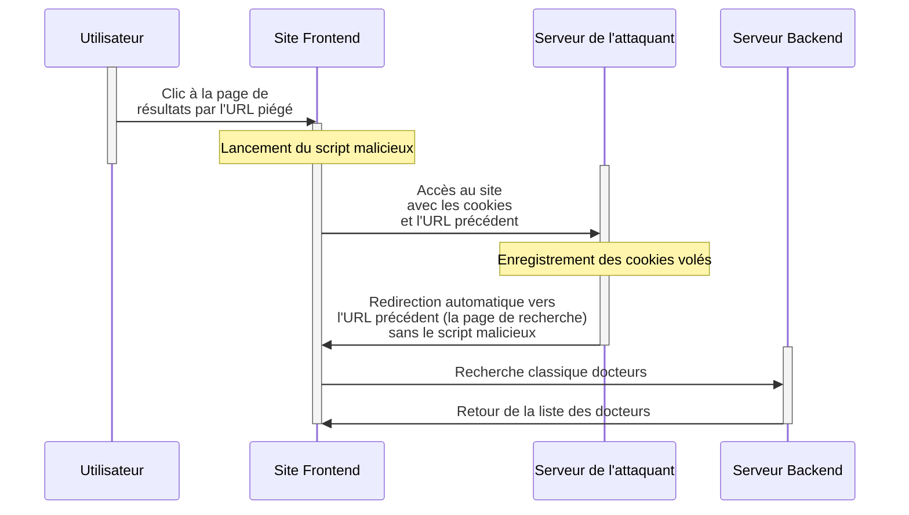

# Attaques XSS
## Par DOM
### Récupération des cookies

```mermaid

sequenceDiagram
    participant u as Utilisateur;
    participant f as Site Frontend;
    participant x as Serveur de l'attaquant;
    participant b as Serveur Backend;

    activate u;
    u->>f: Clic à la page de<br>résultats par l'URL piégé;
    activate f;
    Note over f: Lancement du script malicieux
    deactivate u;

    activate x;
    f->>x : Accès au site<br> avec les cookies<br>et l'URL précédent

    Note over x: Enregistrement des cookies volés

    x->>f : Redirection automatique vers<br>l'URL précédent (la page de recherche)<br>sans le script malicieux
    deactivate x;

    activate b;
    f->>b: Recherche classique docteurs ;
    b->>f: Retour de la liste des docteurs ;
    deactivate b;
    deactivate f;


```