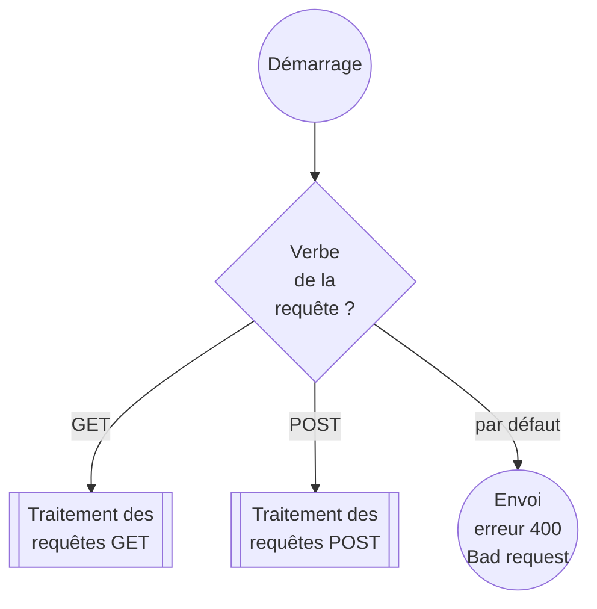
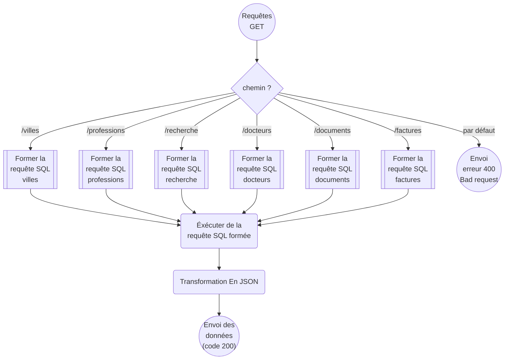
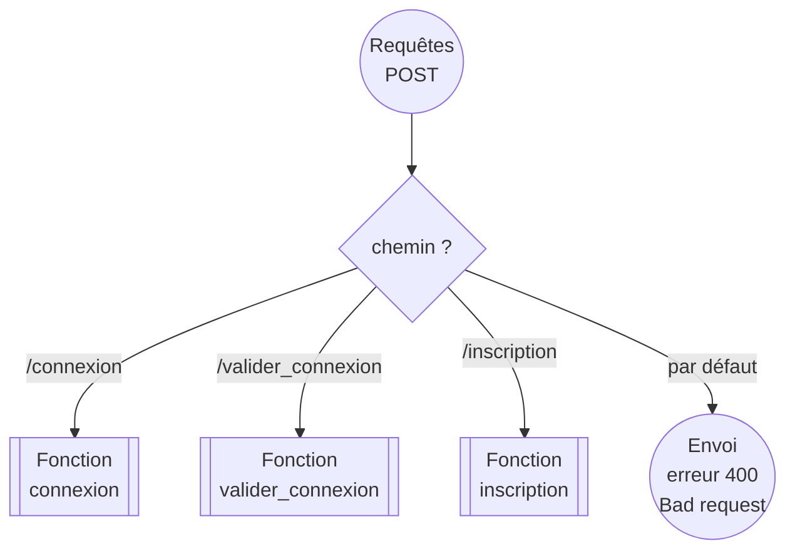
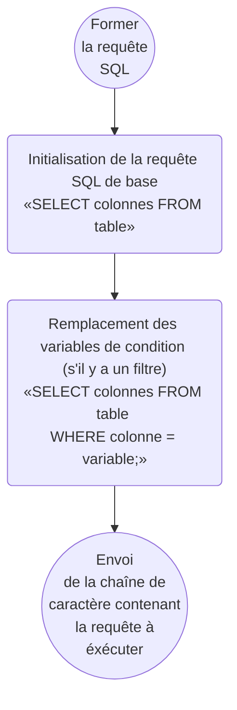

# Back end (API)

## Fonctionnement de l’aiguillage des endpoints

### aiguillage par verble

### aiguillage par chemin GET

### aiguillage par chemin POST

## Fonctionnement des requêtes GET
### Formation des requêtes à éxécuter

