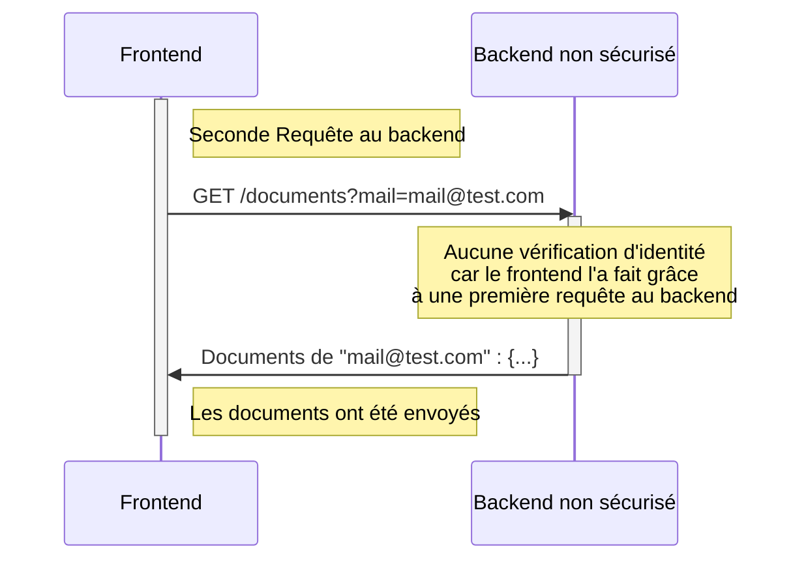
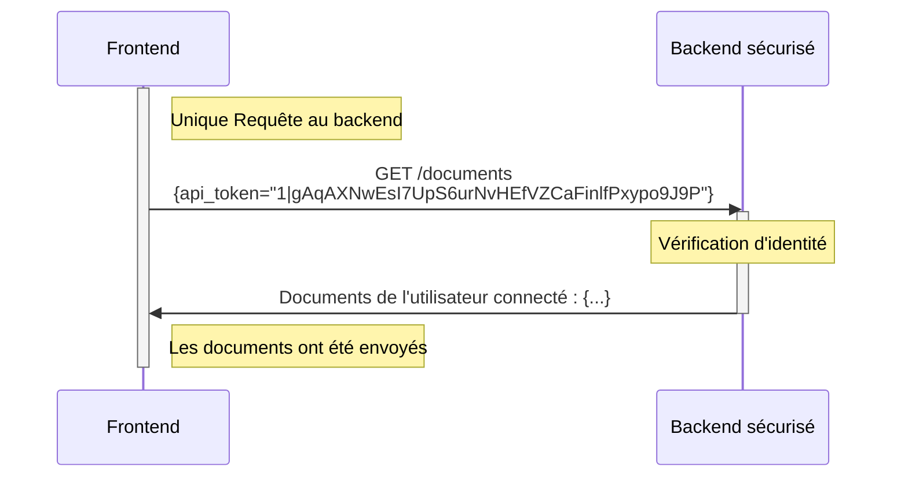
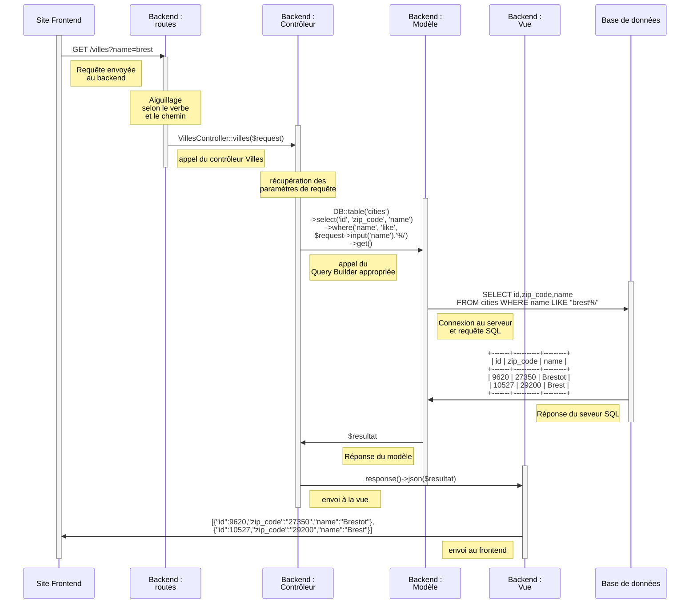
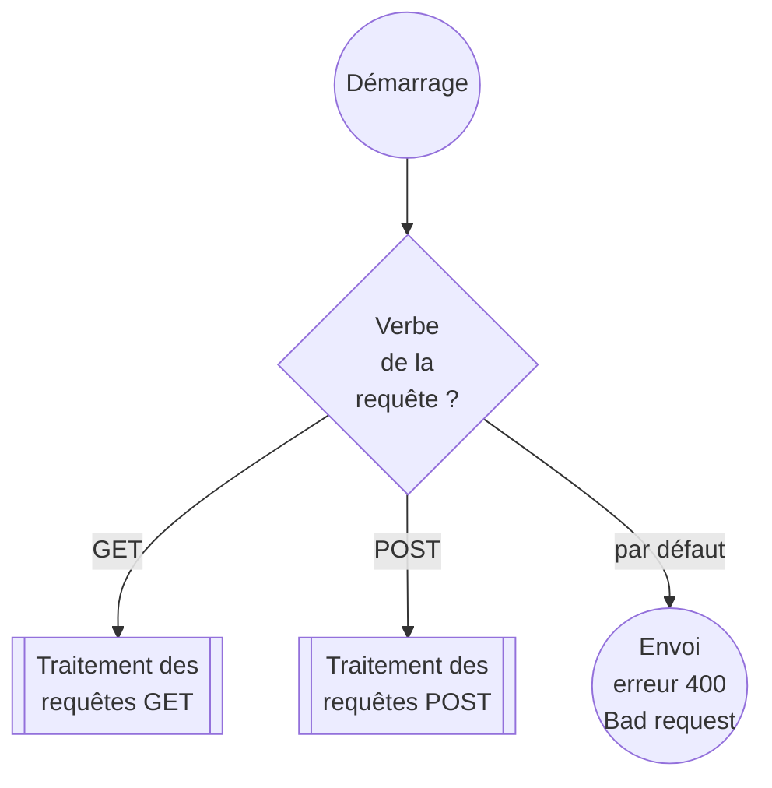
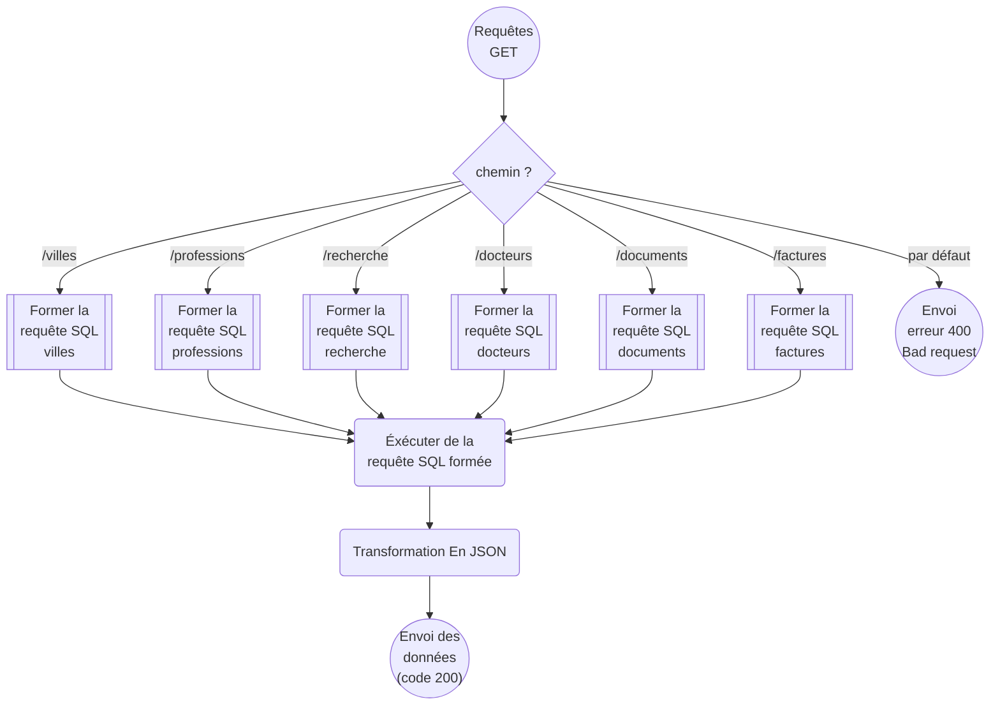
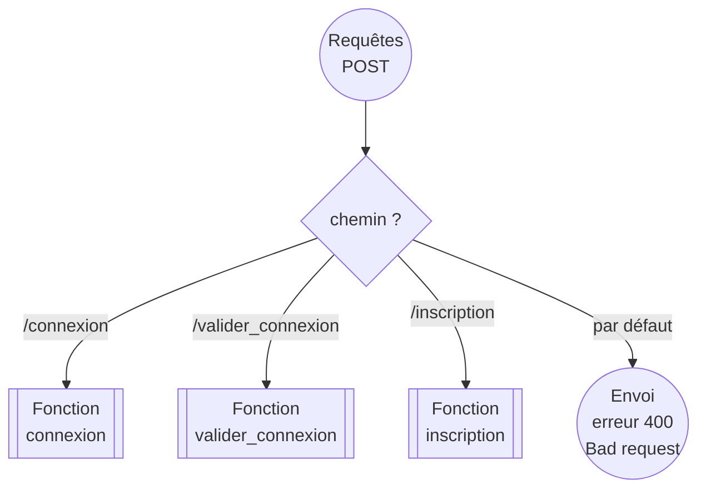
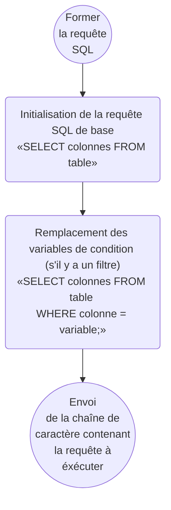
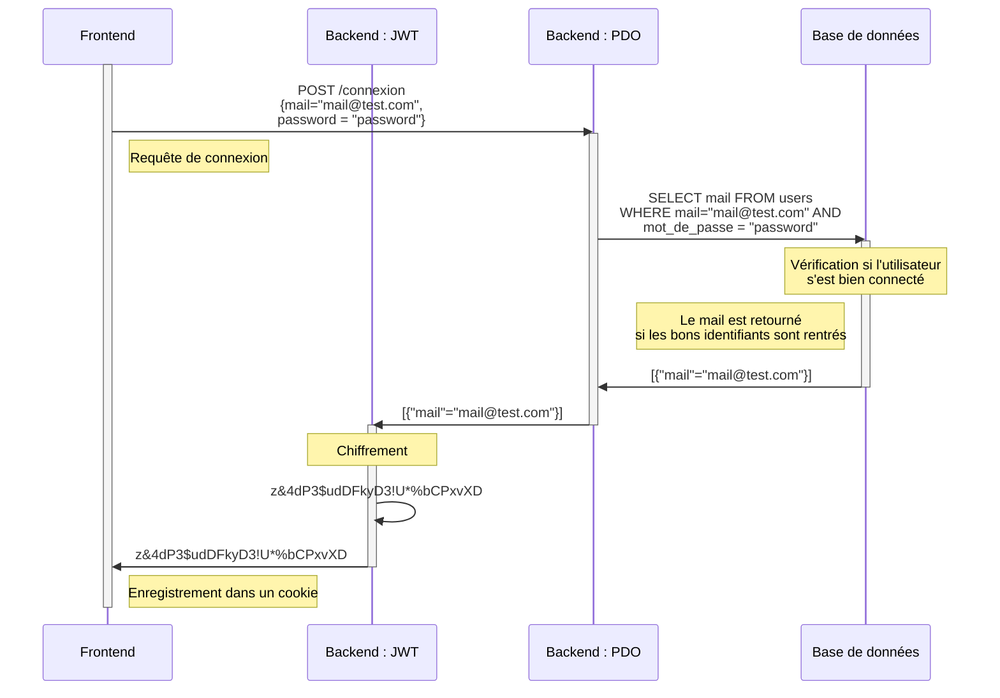
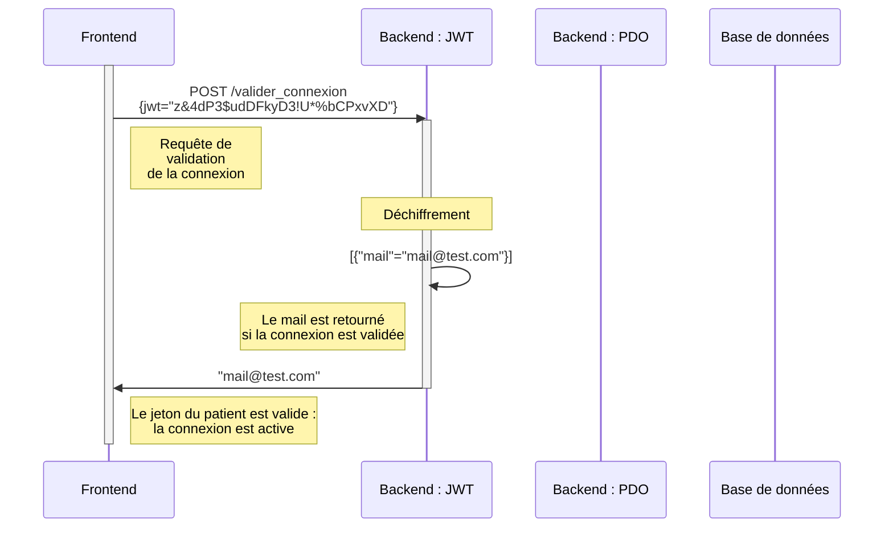

# Back end (API)

## Liste des endpoints POST d'authentification du backend sécurisé et non sécurisé:

### versions
- **non sécurisé** : `1.00`
- **sécurisé** : `2.00`

> Les mentions *(sécurisé)* et *(non-sécurisé)* permettent de différencier les fonctionnalités.

> Les endpoints du backend non sécurisés sont **préfixés après la version de l'API** de `index.php/`. Par exemple : 
> ```
>   /api/1.00/index.php/professions
> ```
> ```
>   /api/2.00/professions
> ```

## Liste des endpoints d'authentification :

### S'inscrire
#### type de requête : 
**POST**
#### URI : 
```
/inscription
```

### Se connecter *(non sécurisé)* : recevoir le token JWT/d'API
#### type de requête : 
**POST**
#### URI : 
```
/connexion
```
#### Payload :
- `mail` : e-mail de l'utilisateur
- `password` : **/!\ Site non sécurisé : transit et stockage en clair** du mot de passe de l'utilisateur 
#### Réponse :
##### Succès *(non sécurisé)*
- Code HTTP : `201`
- Corps de la réponse : Tableau :
  - `mail`
  - `nom`
  - `prénom`
  - `ville`
  - `jwt` : **Jeton de connexion JWT** à sauvegarder

##### Succès *(sécurisé)*
  - *documentation à finaliser*
##### Échec *(non sécurisé)*
- Code HTTP : `401`
- Corps de la réponse : *Connexion failed, please check your id and pwd*

##### Échec *(sécurisé)*
  - *documentation à finaliser*

### Tester si l'utilisateur dispose d'un jeton de connexion valide (s'il est bien connecté)
#### type de requête : 
**POST**
#### URI : 
```
/valider_connexion
```
#### Entêtes *(sécurisé)* :
- `Authentification` :  api_token de la connexion active de l'utilisateur
#### Payload :
- `jwt` *(non-sécurisé)*: jeton JWT récupéré lors de la `/connexion`
#### Réponse :
##### Succès
- Code HTTP : `201`
- Corps de la réponse :
  - `mail` : e-mail de l'utilisateur connecté
##### Échec
- Code HTTP : `401`
- Corps de la réponse : *Bad token, please sign in again*

## Liste des endpoints GET :
### Récupérer la liste de documents
> *(non-sécurisé)* Le Front-end vérifie au préalable si l'utilisateur est connecté avant d'éffectuer la requête

#### type de requête : 
**GET**
#### URI *(non sécurisé)* : 
```
/documents?mail=MAIL
```
#### URI *(sécurisé)* : 
```
/documents
```
#### Paramètres :
- `mail` :  e-mail de l'utilisateur
#### Entêtes *(sécurisé)* :
- `Authentification` :  api_token de la connexion active de l'utilisateur

#### Réponse :
- Tableau :
  - `nom_doc` : Nom affiché à l'écran
  - `type` : nature du document (ordonnance, fomulaire etc.)
  - `chemin` : Où se trouve le fichier sur le serveur : sert pour le bouton *télécharger le document*
  - `date_depot` '*(peut être nul)* : Moment auquel le document a été déposé
  - `signature_docteur` '*(peut être nul)* : Date de signature du docteur
  - `prenom_nom` : Prénom et nom du docteur
  - `mail_docteurs` : adresse e-mail du docteur *(pourquoi pas mettre en lien hypertexte mailto:mail@docteur.com)*
  - `telephone` : téléphone du docteur
  - `nom_site` : nom du lieu de profession
  - `adresse` : rue du site
  - `zip_code` : code postal
  - `ville` : nom de la ville

### Récupérer une ou plusieurs facutures
> ( site non-sécurisé) Le Front-end vérifie au préalable si l'utilisateur est connecté avant d'éffectuer la requête
#### type de requête : 
**GET**
#### URI *(non sécurisé)*: 
```
/factures?mail=MAIL&id=IDENTIFIANT
```
#### URI *(sécurisé)*: 
```
/factures?id=IDENTIFIANT
```
#### Entêtes *(sécurisé)* :
- `Authentification` :  api_token de la connexion active de l'utilisateur
#### Paramètres :
- `mail` *(non sécurisé)* :  e-mail de l'utilisateur
- `id`  **optionnel** :  identifiant de la facture *(récupérée au préalable en réponse de la liste de toute les factures)*. Si renseignée, le tableau en réponse contiendra uniquement la facture désirée.
#### Réponse :
- Tableau :
  - `identifiant` : Numéro unique du document interne à la base de données, sert à le sélectionner ensuite pour visualiser 1 facture
  - `prix_ttc` : Prix toutes taxes comprises
  - `tva` *(peut être nul)* : Montant de la TVA incluse dans le prix TTC
  - `date_facturation` '*(peut être nul)* : Date à laquelle le patient a été facturé
  - `date_paiement` '*(peut être nul)* : Date de paiement du patient
  - `mode_de_paiement` : Moyen de paiement utilisé
  - `mail_docteurs` : adresse e-mail du docteur *(pourquoi pas mettre en lien hypertexte mailto:mail@docteur.com)*
  - `prenom_nom` : Prénom et nom du docteur
  - `telephone` : téléphone du docteur
  - `nom_site` : nom du lieu de profession
  - `adresse` : rue du site
  - `zip_code` : code postal
  - `ville` : nom de la ville

### Récupérer la Liste des villes
type de requête : *GET*

```
/villes?name=NOM
```

### Récupérer la Liste des professions
type de requête : *GET*

```
/professions
```

### Récupérer la Liste des mails, prénoms et noms des docteurs 
type de requête : *GET*

```
/docteurs
```
### Recherche par e-mail de docteur, profession et ville
type de requête : *GET*

```
/recherche?d.prenom_nom=PRENOM NOM&p.nom=PROFESSION&c.name=VILLE
```
Ici, tous les paramètres ne sont pas nécessaire. On peut renseigner **un ou plusieurs** (ou aucun) **paramètres au choix** parmi la Liste de clés suivantes:
- `d.prenom_nom` *Le prénom et le nom du docteur séparés par un espace*
- `p.nom` *le nom de la profession*
- `c.name` *le nom de la ville*

# site web sécurisé

## Authentification
### Sécurisation des routes : comparatif
#### Non sécurisé

#### Sécurisé


## Modèle - Vue - Contrôleur et routage
### exemples avec /villes


# site web non sécurisé
## Fonctionnement de l’aiguillage des endpoints

### aiguillage par verble



### aiguillage par chemin GET


### aiguillage par chemin POST


## Fonctionnement des requêtes GET
### Formation des requêtes à éxécuter



## Fonctionnement des requêtes POST
### Connnexion



### Valider Connnexion


