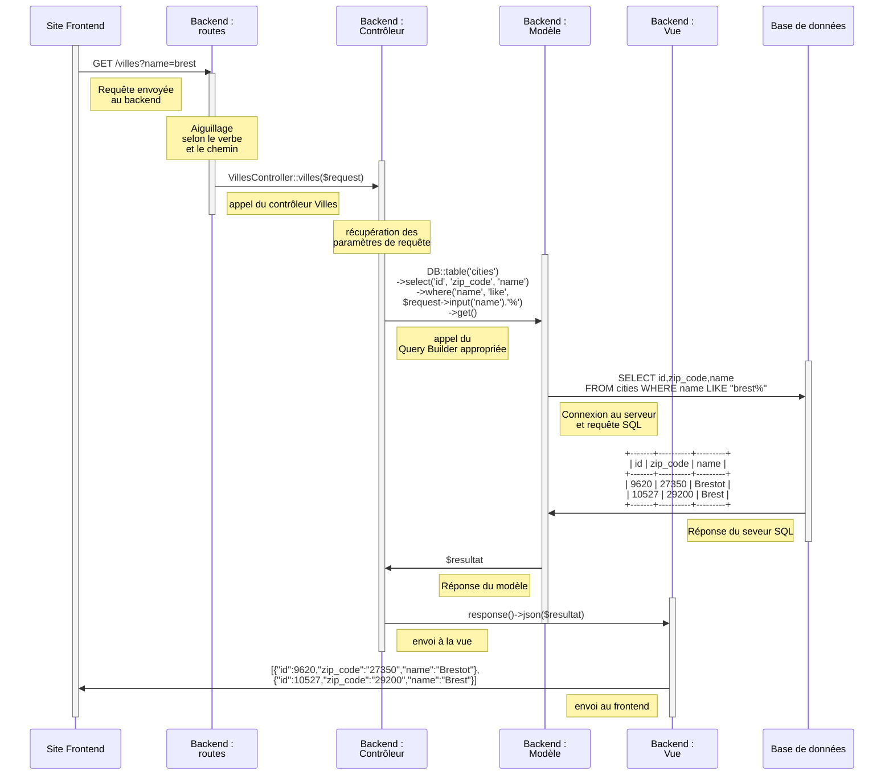
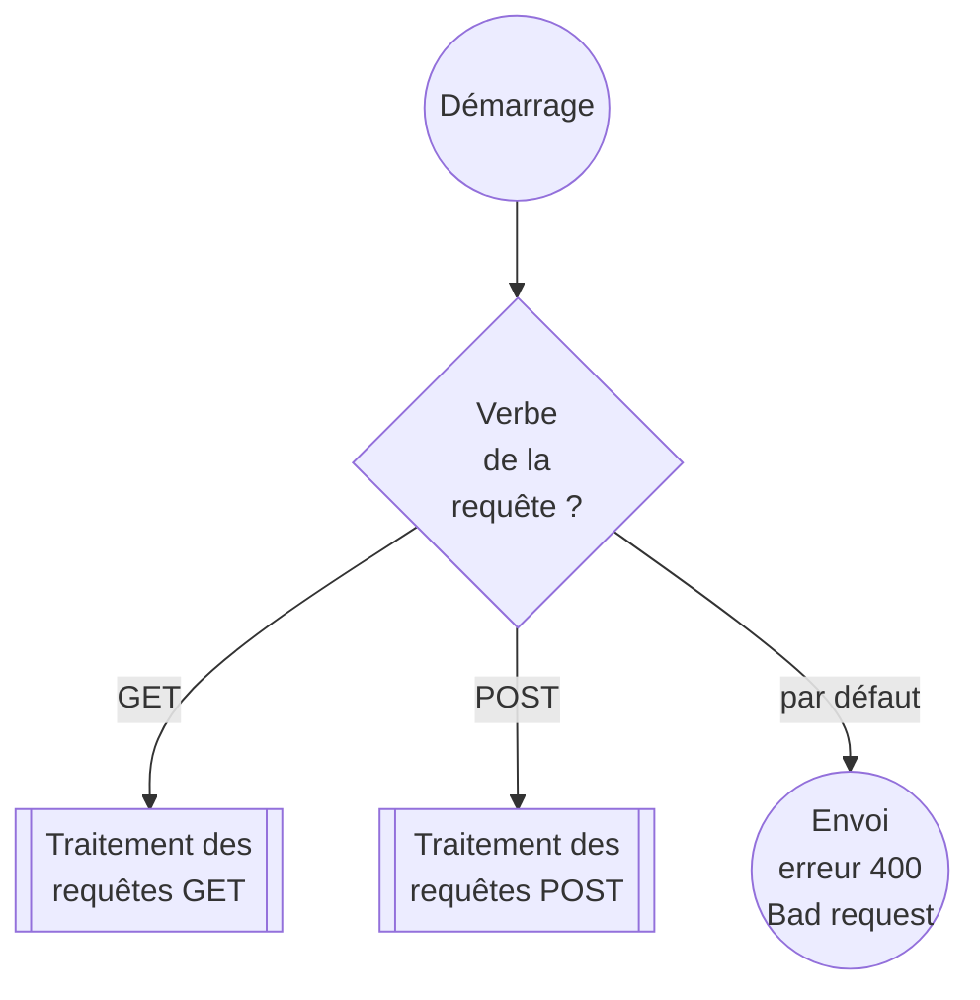
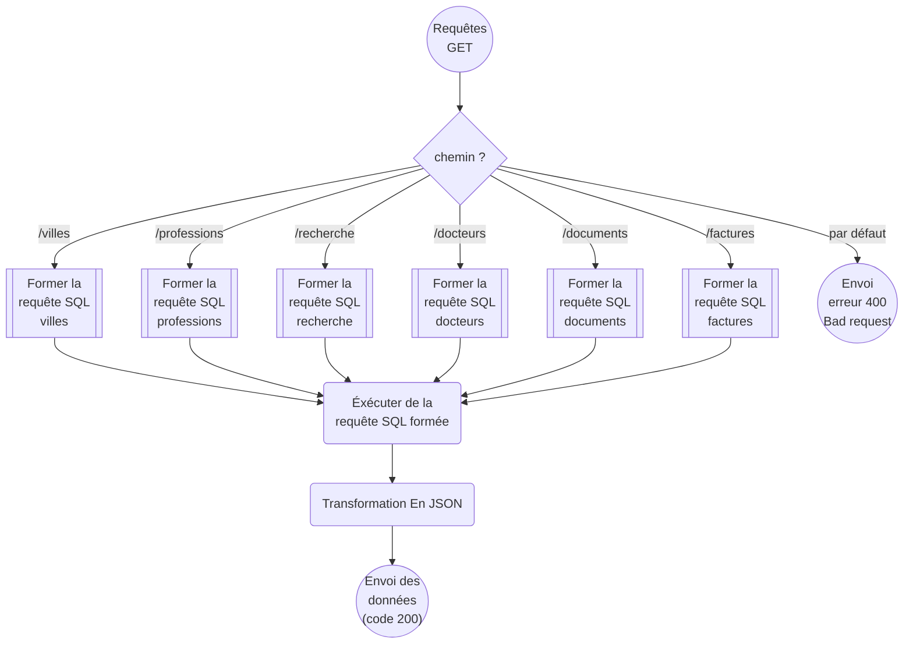
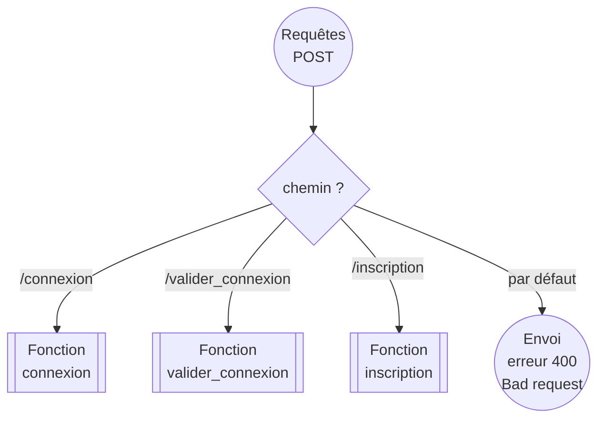
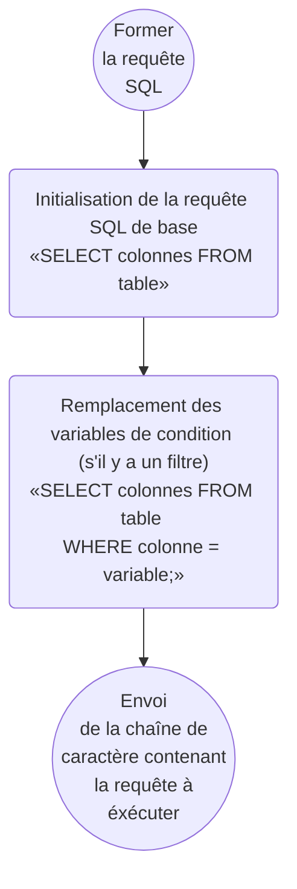
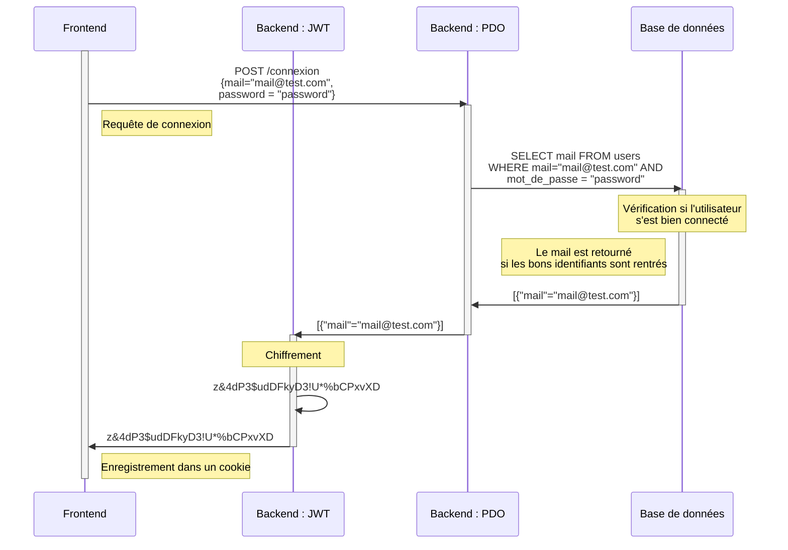
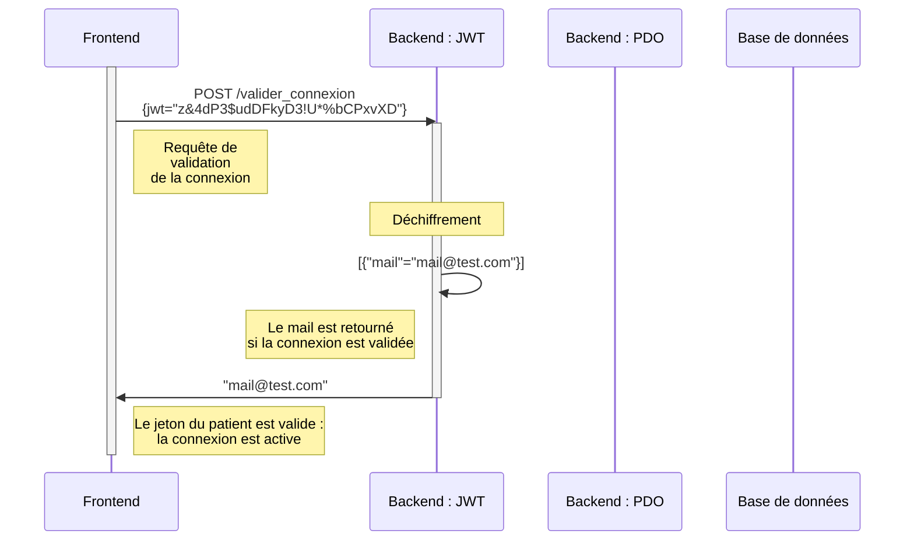

# Back end (API)

# site web sécurisé
## Modèle - Vue - Controlleur et routage
### exemples avec /villes

# site web non sécurisé
## Fonctionnement de l’aiguillage des endpoints

### aiguillage par verble

### aiguillage par chemin GET

### aiguillage par chemin POST

## Fonctionnement des requêtes GET
### Formation des requêtes à éxécuter

## Fonctionnement des requêtes POST
### Connnexion

### Valider Connnexion

