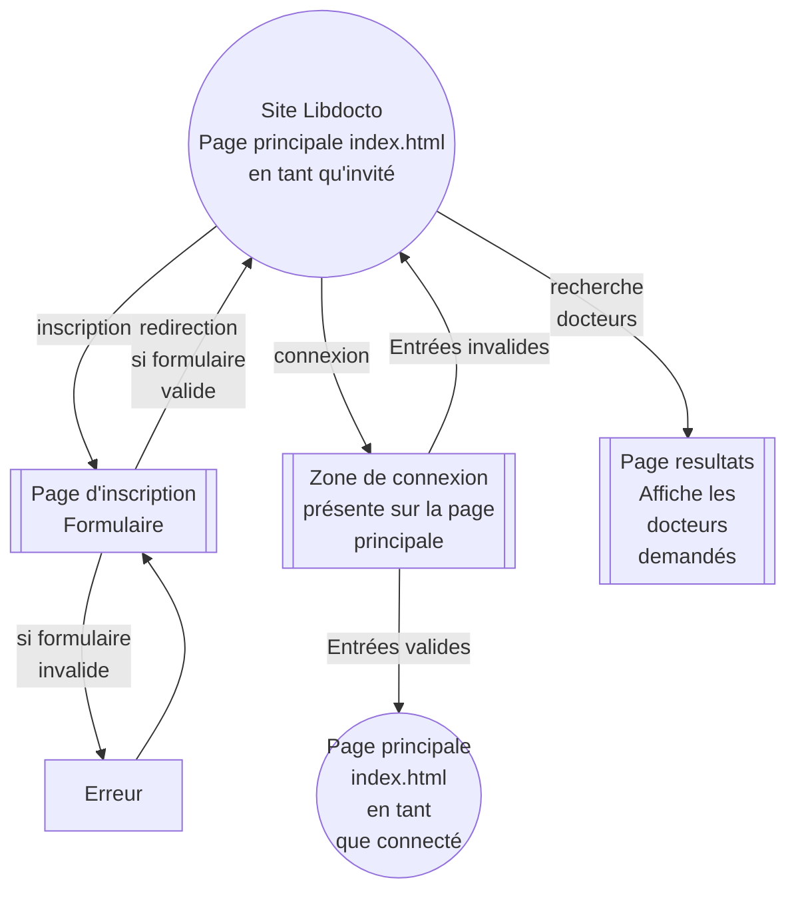
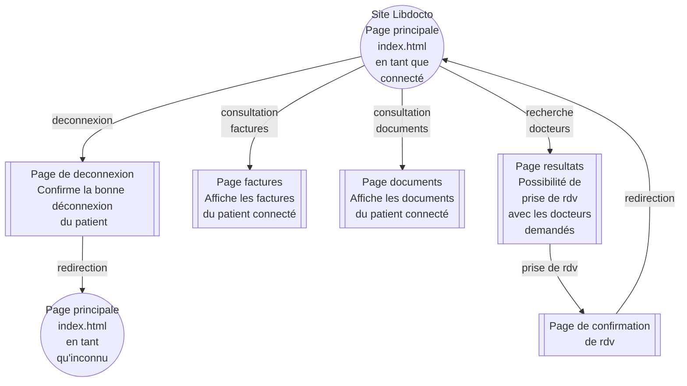
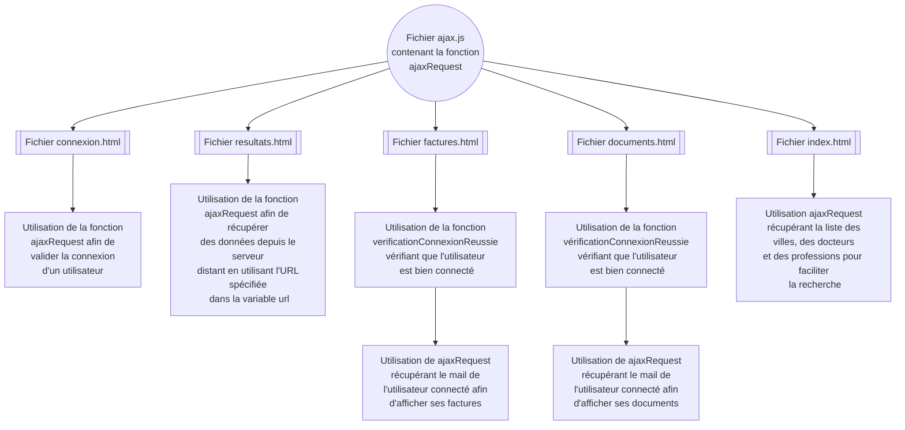
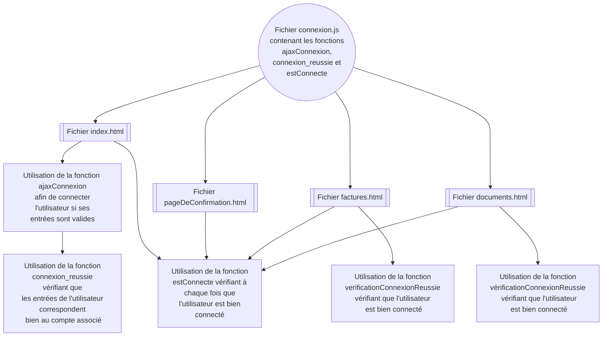
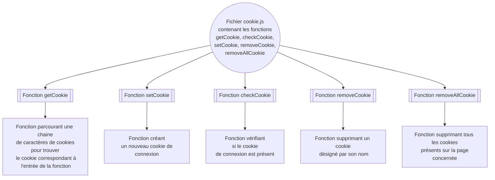
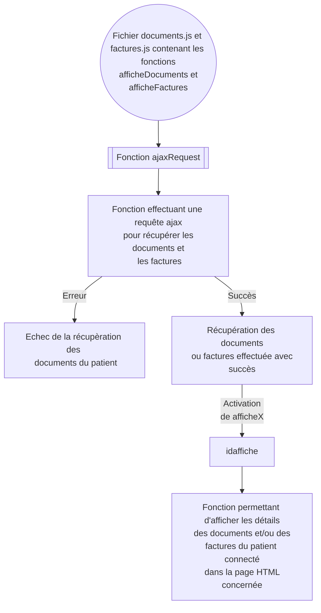
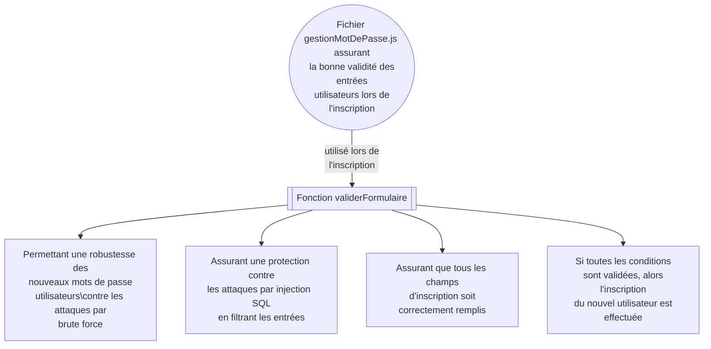
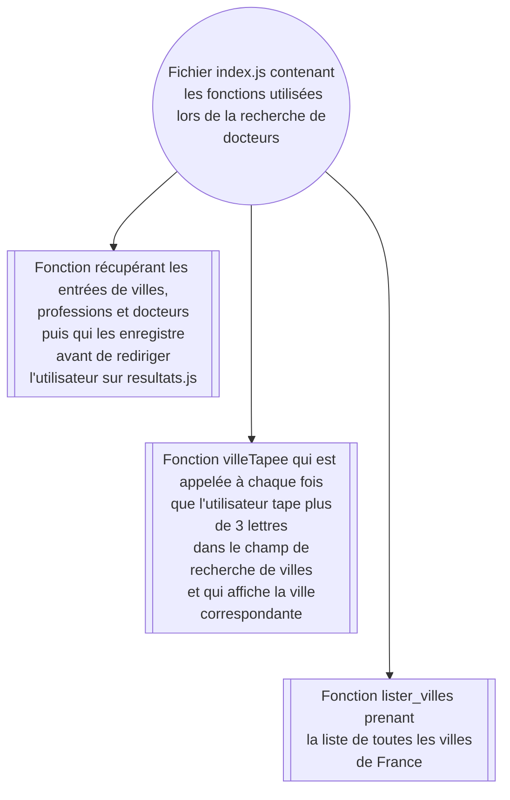
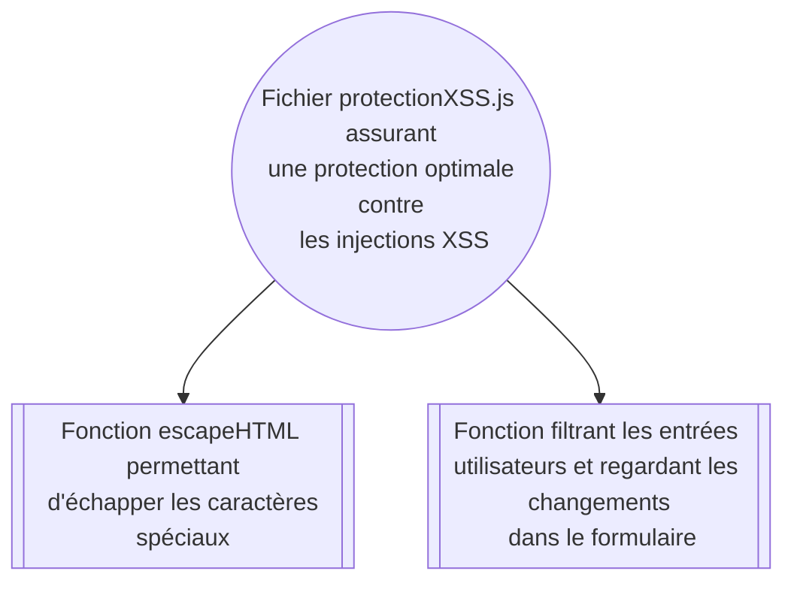
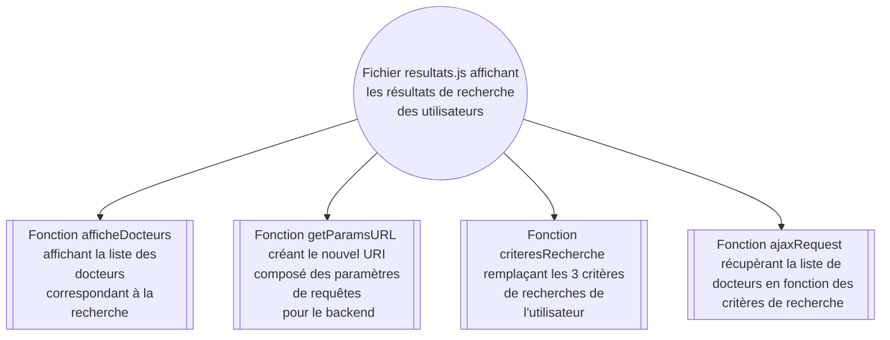

# Front end
## Architecture
- Docker
## Installation
### Créer l'image
#### Constantes d'environnement
Définir les valeurs de la premièr ligne du fichier [FRONT_END/src/javascript/define.js](src/javascript/define.js)
 - Attribuer à la variable `BASE_URL` l'adresse IP **du backend** (127.0.0.1 si en local sur sa machine) puis le **port** choisi **lors du lancement du backend** (séparés par `:`).
>Pour plus de précisions concernant l'adresse IP et le port à marquer, se référer à [BACK_END/INSTALL.md](../BACK_END/INSTALL.md).
 - la variable `API_VERSION` peut aussi être modifiée pour utiliser une version plus récente que la 1.00.
#### Compiler l'image Docker
Une fois l' étape précédente établie
1. Se placer dans le dossier `FRONT_END`
2. Dans un terminal, lancer la commande
    ```bash
    docker build -t projet_m1_frontend:1.0 .
    ```
    Une fois l'image créée, il n'est pas nécessaire de la créer de nouveau pour relancer le serveur, sauf si les fichers sources tel `Define.js` ont été modifiés
### Lancer un conteneur serveur frontend
#### Commande
Une fois l'image créée, lancer la commane suivante en changeant les paramètres en majusucules :
```bash
docker run --rm --detach -p PORT:80/tcp  --name NOM_DU_SERVEUR projet_m1_frontend:1.0
```
#### Paramètres
1. Il faut remplacer les paramètres suivants de la commande précédente conformément au ficher `FRONT_END/javascript/define.js`pour lier la connexion du Front end au back end. 
2. De plus, il faut adapter l'adresse IP et le port dans le `define.js` également :
    ```js
    const BASE_URL="http://ADRESSE_IP_OU_NOM_DE_DOMAINE:PORT";
    ```


| Paramètre      	| Description                                                                                                                                                                                                                                                                       	| Exemple                                  	|
|----------------	|-----------------------------------------------------------------------------------------------------------------------------------------------------------------------------------------------------------------------------------------------------------------------------------	|------------------------------------------	|
| NOM_DU_SERVEUR 	| Nom du conteneur lancé par docker                                                                                                                                                                                                                                                 	| serveur_frontend                              	|
| PORT           	| Port de connexion au frontend.                                                                                                                                                                                                                     	| 2345                                     	|
## Compatibilité
- Firefox
- *Les navigateurs basés sur Chrome exigent le HTTPS pour certaines requêtes, alors Chrome n'est pas compatible.*
## Utilisation
- Ouvrir dans Firefox `ADRESSE_IP:PORT`
  - avec l'adresse IP du docker (127.0.0.1 si hébergé sur son PC)
  - et le port défini précédemment
- Pour afficher la **liste de tous les docteurs** créés pour le test du site web, il suffit de cliquer sur **chercher** en ne renseignant aucun critère de recherche.
- Un compte de test a été créé. Ce compte possède des documents et des factures :
  - identifiant : `mail@test.com`
  - mot de passe : `password`
## Suivi du fonctionnement
### Logs
Taper dans un terminal la commande suivante
```bash
docker logs NOM_DU_SERVEUR 
```
### Récupération du système de fichiers interne
Pour débuger le fonctionnement de l'image, il est possible de récupérer les fichiers du conteneur docker. Pendant son éxecution, taper dans un terminal la commande suivante
```bash
docker export -o NOM_DU_SERVEUR.tar NOM_DU_SERVEUR
```
Ensuite, extraire l'archive (comme un .zip) créée dans le dossier courant.


### Schema Mermaid Pages du site ### 
## Page non connecté 



## Page connecté 



# Schema Mermaid #

## Relations entre fichiers JS et fichiers HTML ##

### Fichier ajax.js ### 



### Fichier connexion.js ### 



### Fichier cookie.js ###



### Fichier documents.js et factures.js ###


### Fichier gestionMotDePasse.js ###



### Fichier index.js ###



### Fichier protectionXSS.js ### 



### Fichier resultats.js ###

