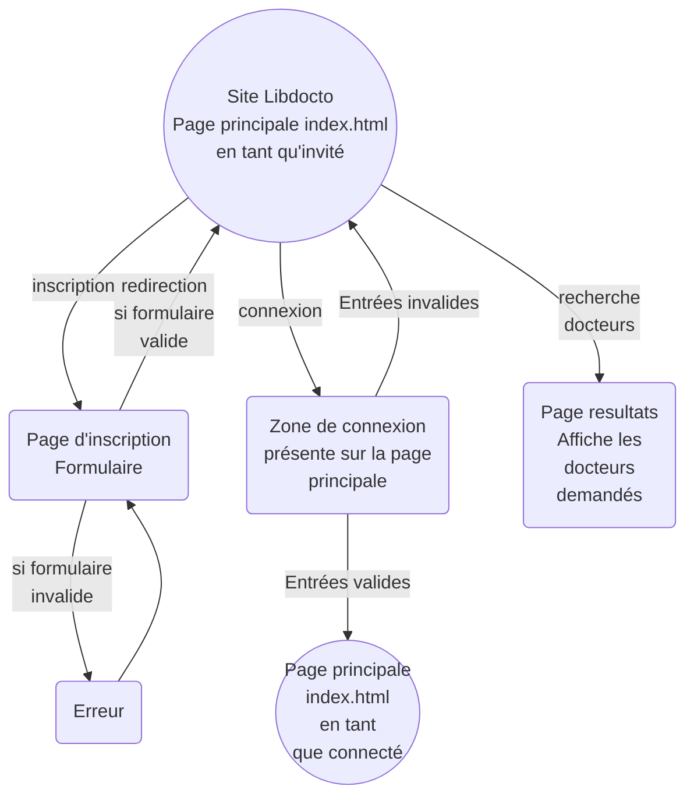
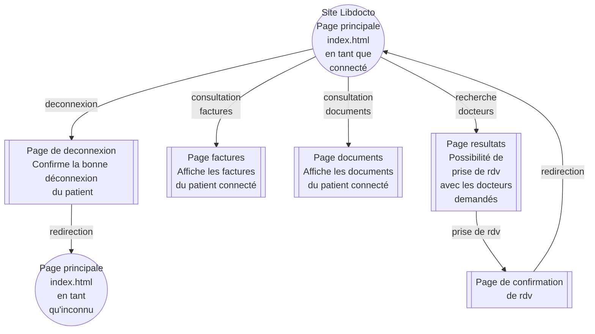
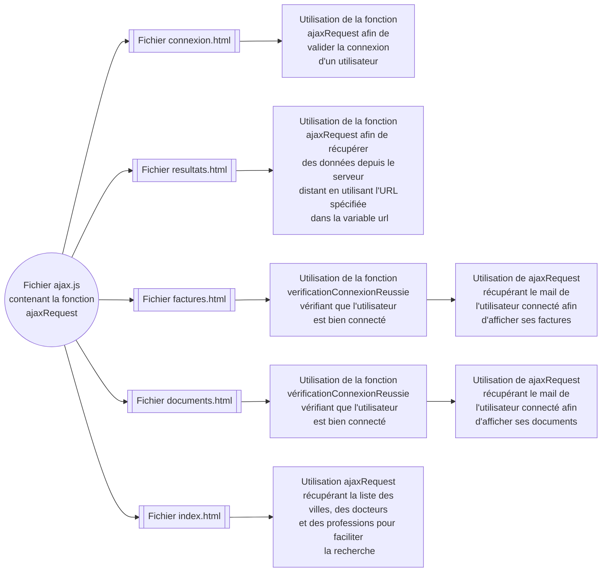
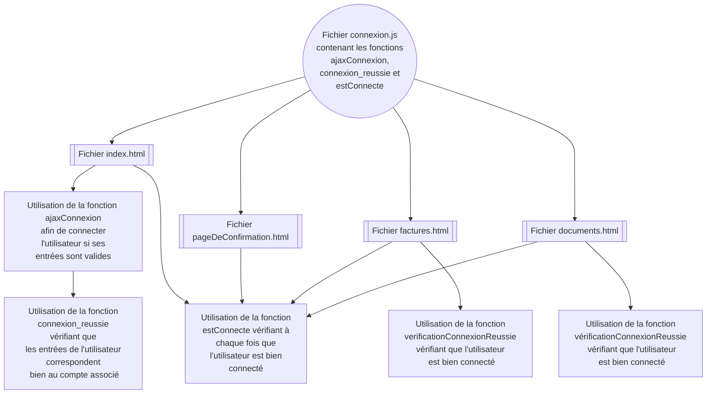
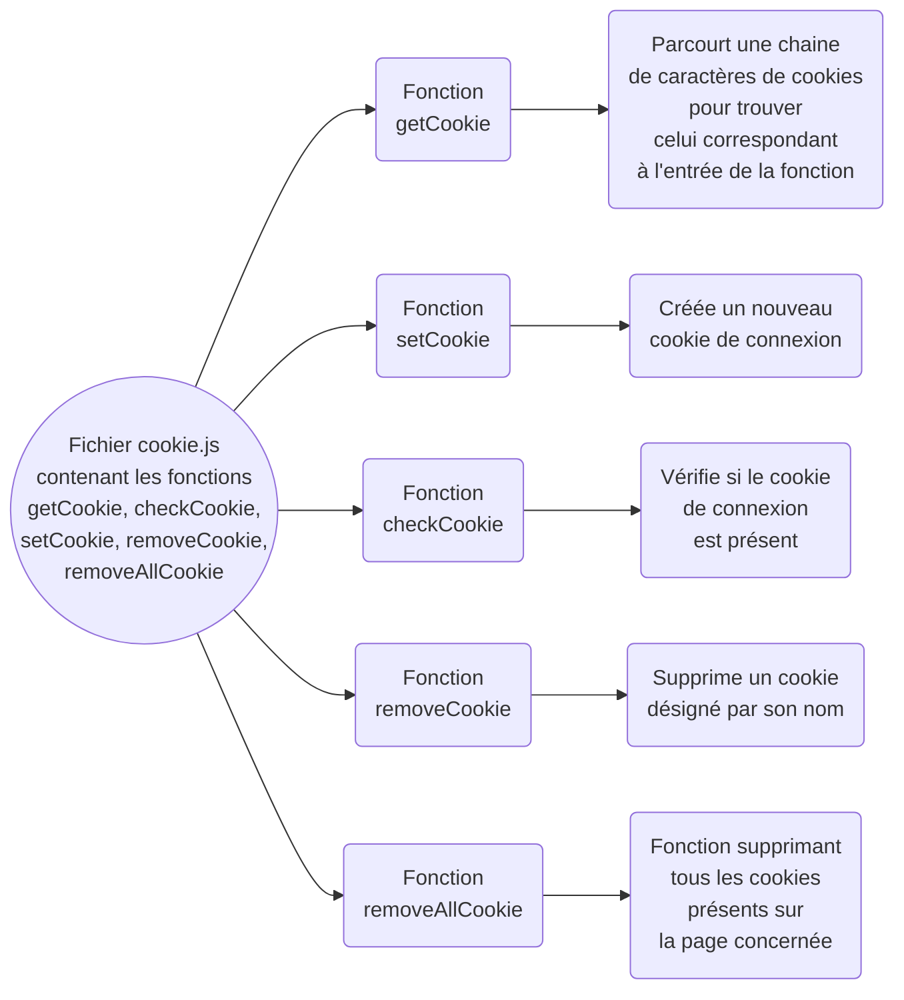
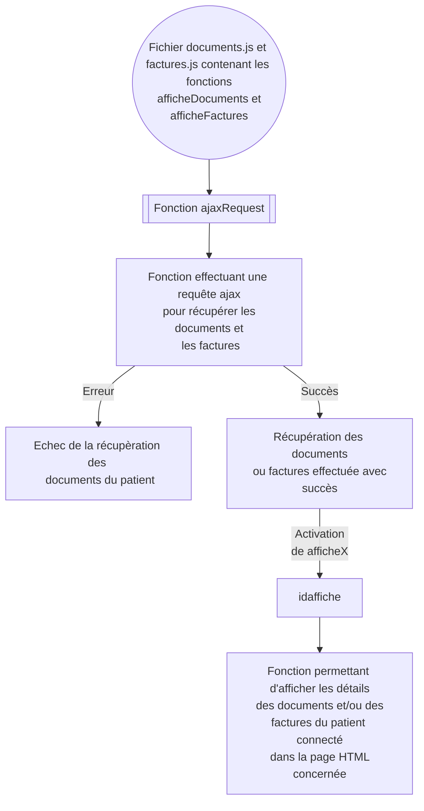
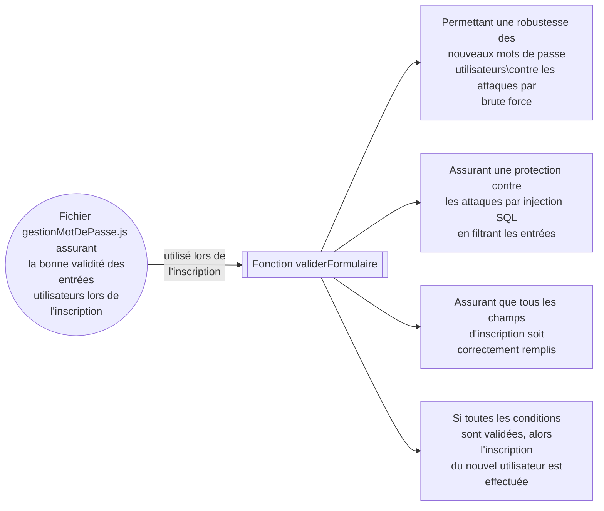
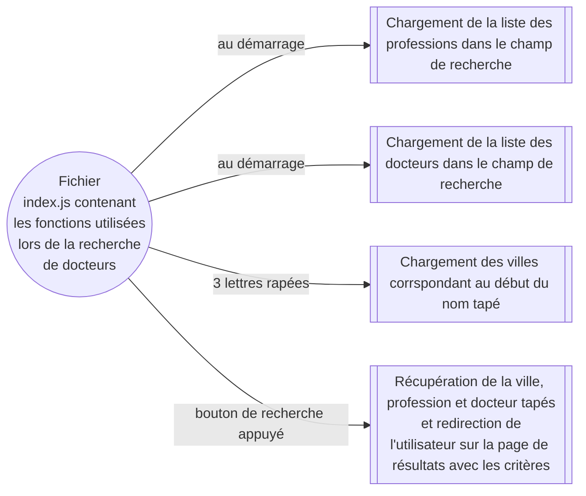
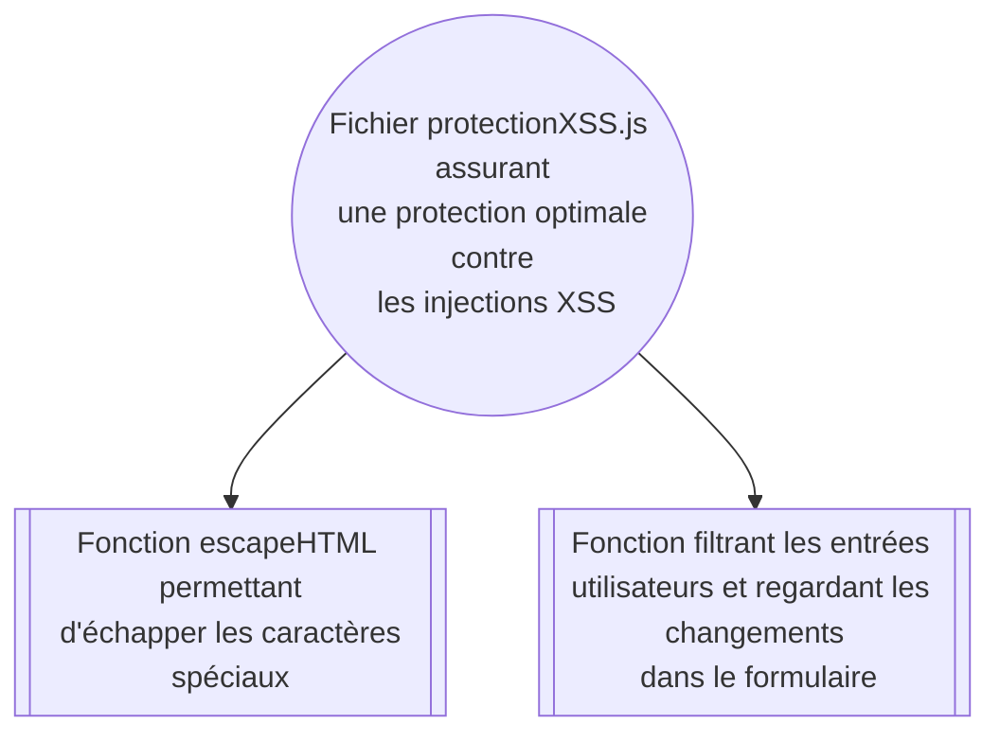
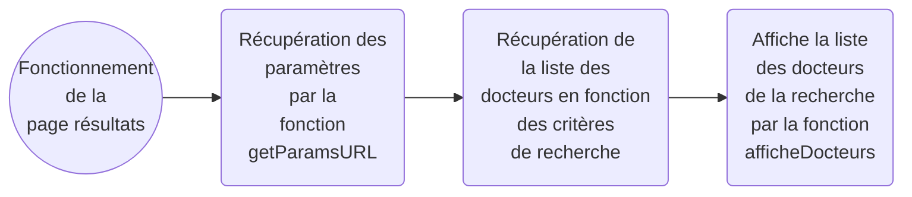

# Installation du serveur Frontend 
## Lire [`FRONT_END/INSTALL.md` pour suivre les instruction d'installation et de lancement](INSTALL.md)

# Utilisation du site
- Ouvrir dans Firefox `ADRESSE_IP:PORT`
  - avec l'adresse IP du docker (127.0.0.1 si hébergé sur son PC)
  - et le port défini précédemment
- Pour afficher la **liste de tous les docteurs** créés pour le test du site web, il suffit de cliquer sur **chercher** en ne renseignant aucun critère de recherche.
- Un compte de test a été créé. Ce compte possède des documents et des factures :
  - identifiant : `mail@test.com`
  - mot de passe : `password`

# Schémas de fonctionnement du frontend 
## Page non connecté 

## Page connecté 

## Relations entre fichiers JS et fichiers HTML ##

### Fichier ajax.js ### 

### Fichier connexion.js ### 

### Fichier cookie.js ###

### Fichier documents.js et factures.js ###

### Fichier gestionMotDePasse.js ###

### Fichier index.js ###

### Fichier protectionXSS.js ###

### Fichier resultats.js ###

