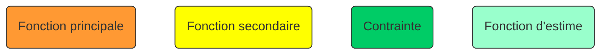
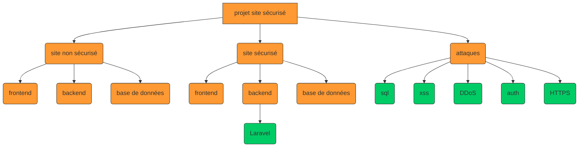
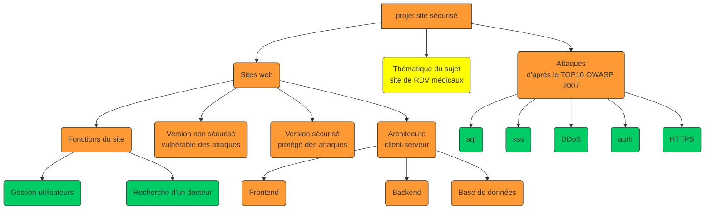

# projet-site-securise
Projet M1 pédagogique d'élaboration d'un site web avec une version sécurisée et non sécurisée

# Installation
1. Télécharger le code source (sur la branche *main*)
2. Installer la base de données : [BDD/README.md](BDD/README.md)
3. Installer le backend : [BACK_END/INSTALL.md](BACK_END/INSTALL.md)
4. Installer le frontend : [FRONT_END/README.md](FRONT_END/README.md)

# Utilisation
[FRONT_END/README.md](FRONT_END/README.md)

# sources
## frontend
- [Template sélectionné](https://www.w3schools.com/w3css/tryw3css_templates_apartment_rental.htm)
- [Code du template selectionné](https://www.w3schools.com/w3css/tryit.asp?filename=tryw3css_templates_apartment_rental&stacked=h)
- [W3CSCHOOL templates](https://www.w3schools.com/w3css/w3css_templates.asp)
- [Requêtes AJAX](https://www.pierre-giraud.com/javascript-apprendre-coder-cours/ajax-xmlhttprequest/)
- [Gestion de cookies de connexion](https://developer.mozilla.org/fr/docs/Web/HTTP/Cookies)
## backend
### bibliothèques
- [Lecture de tokens d'environnement en .env : vlucas/phpdotenv](https://github.com/vlucas/phpdotenv)
- [Authentification par JWT  : firebase/php-jwt](https://github.com/firebase/php-jwt)

## base de données
- [Régions, départements, villes et villages de France et d'outre-mer : data.gouv.fr](https://www.data.gouv.fr/fr/datasets/regions-departements-villes-et-villages-de-france-et-doutre-mer/#resources)
- [Annuaire santé de la Cnam, établissements de santé (Etablissements PRADO) : data.gouv.fr](https://www.data.gouv.fr/fr/datasets/5ac4f20fc751df5567500c0a/#resources)
## attaques
### xss
- [Serveur HTTP avec Python](https://pythonbasics.org/webserver/)

# Graphiques

Légende : 

## Architecture du projet

## Taxonomie des fonctions
